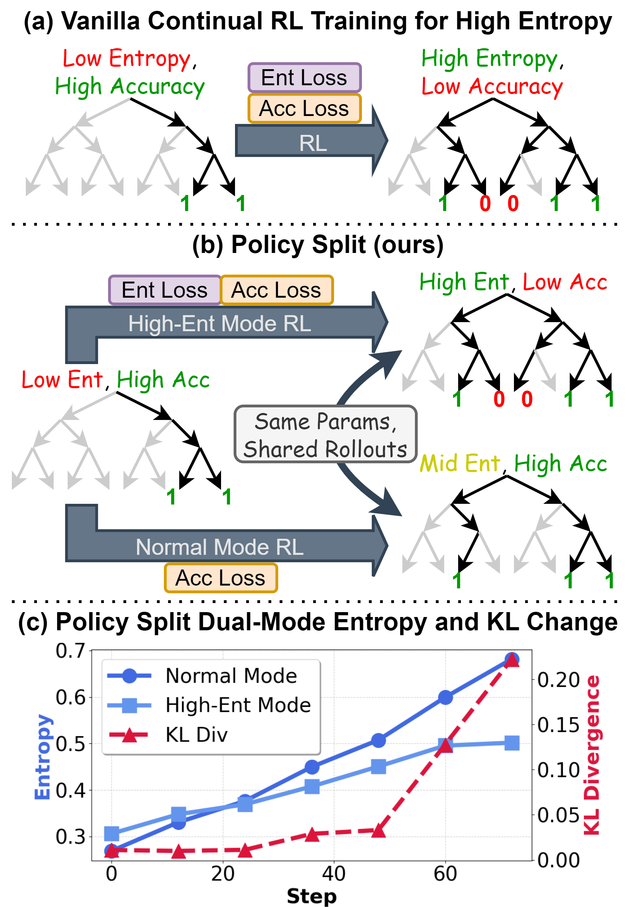
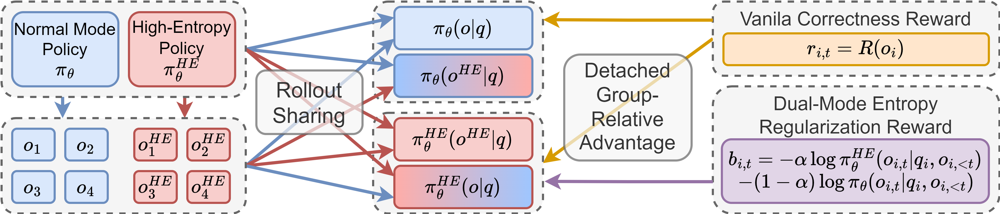

# Policy Split

**Incentivizing Dual-Mode Exploration in LLM Reinforcement with Dual-Mode Entropy Regularization**

[📄 Paper](https://arxiv.org/abs/2604.11510) · [💻 Code](https://github.com/BITHLP/PolicySplit) · **English** | [简体中文](README.zh-CN.md)

---

Entropy-guided RL for LLMs faces a fundamental exploration–exploitation conflict: pushing for higher entropy often degrades accuracy, especially when continually post-training low-entropy large reasoning models (LRMs) that are already proficient. **Policy Split** resolves this by bifurcating a single model into two collaborating policies — a **normal mode** optimized for correctness and a **high-entropy mode** that prefers exploration — trained together via **dual-mode entropy regularization**.

<p align="center"></p>
<p align="center"><em>(a) Naively preferring high entropy can drop accuracy. (b) Policy Split bifurcates the policy into a normal mode and a high-entropy mode (identified by a high-entropy system prompt) that share parameters and rollouts. (c) Dual-mode entropy regularization drives the two modes to distinct entropy behaviors and a growing KL divergence.</em></p>

## Key Idea

Instantiate two policies inside one model that benefit from each other's experience:

- **Normal mode** `π_θ(·|q)` — trained with vanilla GRPO advantages for **correctness only**.
- **High-entropy mode** `π_θ^HE(·|q) = π_θ(·|s,q)` — same parameters, activated by a high-entropy system prompt `s`, and trained with an **entropy-regularized advantage** that adds (i) an entropy preference and (ii) a KL term pushing it away from the normal mode, with clamping for stability.
- **Inter-policy collaboration** via **rollout sharing**: the normal mode learns from newly discovered correct rollouts, while the high-entropy mode is kept from collapsing by stable correct responses — at the cost of ~1.4× GRPO training time.

> Note: simply prepending a high-entropy prompt is **not** enough — the output distribution barely shifts (KL ≈ 0.01). Explicit training is required to establish a real high-entropy mode.

<p align="center"></p>
<p align="center"><em>The Policy Split training framework: rollouts are sampled from both modes and shared, then each is assigned its corresponding correctness-only or entropy-regularized advantage.</em></p>

## Highlights

- **Consistent gains.** Outperforms strong entropy-guided RL baselines in average accuracy across Qwen3-1.7B/4B/8B (all improvements over the base model pass significance testing at *p* < 0.01), while **reviving entropy** in low-entropy LRMs.
- **Two artifacts, one model.** The normal mode is more rigorous and excels at general tasks; the high-entropy mode excels at creative writing — switchable at inference time by a simple prompt.
- **Genuine dual-mode split.** Policy Split greatly enlarges the inter-mode KL divergence and behavioral gap, whereas prompting the original model or vanilla GRPO barely changes behavior.
- **Higher Best-of-N.** The high-entropy mode finds more *unique* correct rollouts (higher best-of-8), providing distinct learning signals during training.
- **Some prompt generalization.** A rewritten high-entropy prompt still induces high entropy, though following an unseen low-entropy instruction remains a bottleneck.

## Method at a Glance

| Component | Normal mode | High-entropy mode |
|-----------|-------------|-------------------|
| Activation | no system prompt | high-entropy system prompt |
| Advantage | vanilla GRPO (correctness only) | GRPO + clamped entropy & KL term |
| Objective | preserve accuracy | encourage novel exploration |
| Best use | general / precision tasks | creative tasks |

Both modes share parameters and rollouts and are always trained with their own advantage type, regardless of which mode produced the rollout.

## Citation

```bibtex
@article{yao2026policy,
  title={Policy Split: Incentivizing Dual-Mode Exploration in LLM Reinforcement with Dual-Mode Entropy Regularization},
  author={Yao, Jiashu and Huang, Heyan and Wu, Daiqing and Liu, Zeming and Guo, Yuhang},
  journal={arXiv preprint arXiv:2604.11510},
  year={2026}
}
```
